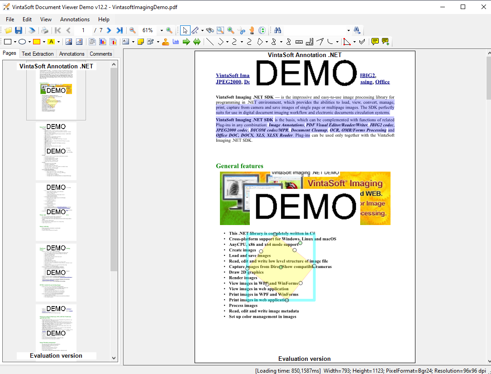

# VintaSoft WPF Document Viewer Demo

This C# project uses <a href="https://www.vintasoft.com/vsimaging-dotnet-index.html">VintaSoft Imaging .NET SDK</a> and demonstrates how to view and annotate images and documents in WPF:
* Load documents (DOC, DOCX, XLSX, XLS, PDF) and images (BMP, CUR, EMF, GIF, ICO, JBIG2, JPEG, JPEG2000, JPEG-LS, PCX, PNG, TIFF, BigTIFF, WMF, RAW) from file.
* Acquire images from scanner.
* Display and print loaded documents and images.
* Annotate loaded documents and images: add/edit/copy/paste/cut/delete annotation, burn annotations on image.
* Use 20+ predefined annotation types.
* Extract text from loaded documents.
* Search text in loaded documents.
* Change settings for image(s) and thumbnail(s) preview.
* Use visual tools in viewer: selection, magnifier, zoom, pan, scroll.
* Save annotated documents and images to a PDF, TIFF, JPEG or PNG file.


## Screenshot



## Usage
1. Get the 30 day free evaluation license for <a href="https://www.vintasoft.com/vsimaging-dotnet-index.html" target="_blank">VintaSoft Imaging .NET SDK</a> as described here: <a href="https://www.vintasoft.com/docs/vsimaging-dotnet/Licensing-Evaluation.html" target="_blank">https://www.vintasoft.com/docs/vsimaging-dotnet/Licensing-Evaluation.html</a>

2. Update the evaluation license in "CSharp\MainForm.cs" file:
   ```
   Vintasoft.Imaging.ImagingGlobalSettings.Register("REG_USER", "REG_EMAIL", "EXPIRATION_DATE", "REG_CODE");
   ```

3. Build the project ("WpfDocumentViewerDemo.Net7.csproj" file) in Visual Studio or using .NET CLI:
   ```
   dotnet build WpfDocumentViewerDemo.Net7.csproj
   ```

4. Run compiled application and try to view and annotate images and documents.


## Documentation
VintaSoft Imaging .NET SDK on-line User Guide and API Reference for .NET developer is available here: https://www.vintasoft.com/docs/vsimaging-dotnet/


## Support
Please visit our <a href="https://myaccount.vintasoft.com/">online support center</a> if you have any question or problem.
